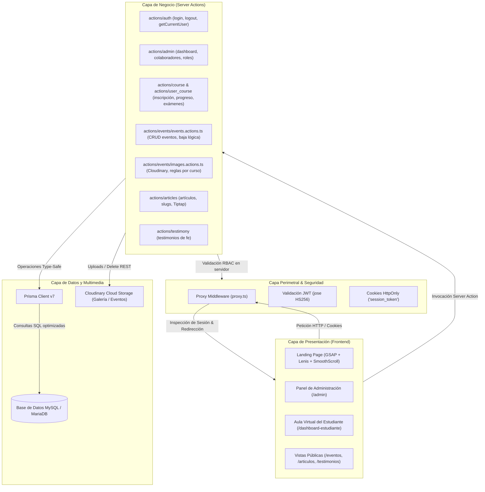
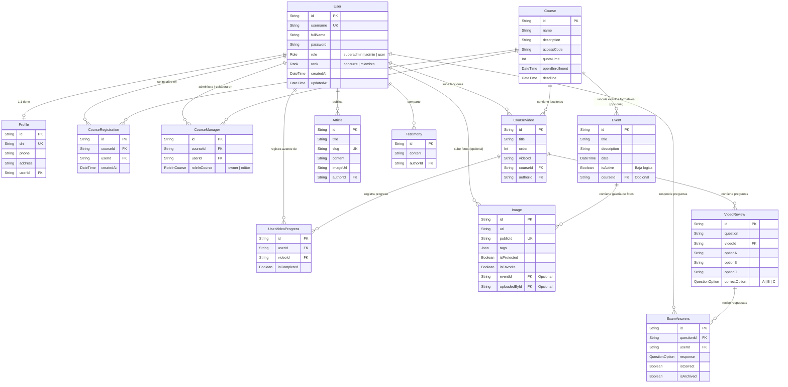
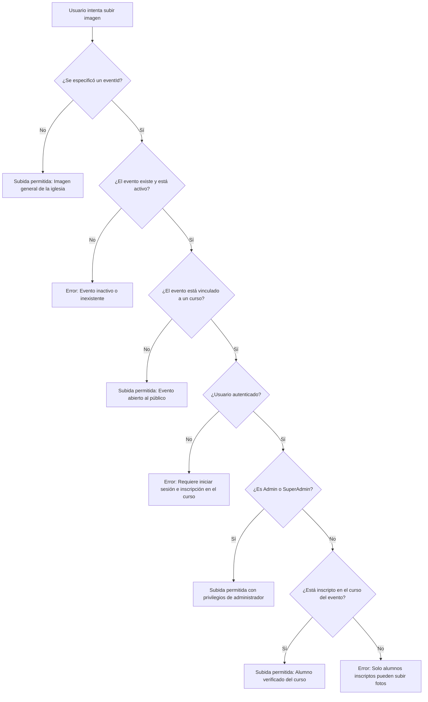

# 📐 Arquitectura del Sistema - Juntos Somos Iglesia

Este documento describe la arquitectura técnica, modelo de datos, flujo de autenticación, control de accesos (RBAC) y patrones de diseño utilizados en el proyecto **Juntos Somos Iglesia**.

---

## 1. Visión General de la Arquitectura

El sistema está estructurado sobre **Next.js 16.1 con App Router**, aplicando el patrón de **Server Actions** para la lógica de negocio, **Prisma ORM** como capa de acceso a datos, y control perimetral mediante **Proxy / Middleware**.



---

## 2. Modelo de Datos y Entidades (ERD)

El esquema de base de datos (`prisma/schema.prisma`) modela la interacción entre usuarios, perfiles, cursos, lecciones en video, evaluaciones, artículos, testimonios, eventos e imágenes:



---

## 3. Control de Acceso Basado en Roles (RBAC)

El sistema define 3 roles de usuario jerárquicos:

1. **`superadmin`**:
   - Acceso total a todas las secciones del sistema.
   - Administración de usuarios y administradores.
   - Gestión de cursos, artículos, testimonios, eventos y galería.
2. **`admin`**:
   - Gestión y creación de cursos (como dueño `owner` o colaborador `editor`).
   - Gestión integral de eventos (creación, edición, baja lógica, restauración).
   - Gestión de imágenes (favoritas, proteger, editar, eliminar).
   - Monitoreo de estadísticas de cursos y alumnos.
3. **`user` (Estudiante / Miembro)**:
   - Inscripción a cursos mediante código de acceso.
   - Visualización de videos y resolución de cuestionarios.
   - Subida de imágenes a eventos vinculados a los cursos en los que está inscripto.
4. **Público General (Sin Sesión)**:
   - Navegación en Landing Page, Prédicas, Artículos y Testimonios públicos.
   - Consulta de cartelera de eventos activos.
   - Subida de fotos anónimas a la galería general o eventos no restringidos por curso.

---

## 4. Arquitectura del Módulo de Eventos & Galería Cloudinary

### Reglas de Negocio para Subida de Imágenes



### Ciclo de Vida y Baja Lógica de Eventos

- **Creación**: Registrado con `isActive: true`.
- **Baja Lógica (`deleteEvent`)**: En lugar de ejecutar `DELETE` SQL destructivo, se actualiza `isActive: false`.
  - Las consultas públicas (`getEvents`, `getEventById`) ignoran automáticamente eventos inactivos.
  - El panel de administración puede consultar eventos inactivos y restaurarlos (`restoreEvent`).

---

## 5. Estructura de Directorios

```
juntos-somos-iglesia/
├── actions/                         # Server Actions (Capa de Negocio)
│   ├── admin/                       # Estadísticas y gestión de administradores
│   ├── articles/                    # Publicación y edición de artículos
│   ├── auth/                        # Login, logout y sesiones JWT
│   ├── course/                      # Gestión de cursos, videos y evaluaciones
│   ├── events/                      # Módulos de Eventos e Imágenes Cloudinary
│   │   ├── events.actions.ts        # Server Actions de Eventos (CRUD, baja lógica)
│   │   └── images.actions.ts        # Server Actions de Imágenes (Upload, favoritas, Cloudinary)
│   ├── testimony/                   # Gestión de testimonios
│   ├── user_course/                 # Inscripción rápida y cuestionarios de alumnos
│   └── user.ts                      # Validaciones de sesión y jerarquía de roles
├── app/                             # Rutas de Next.js (App Router)
│   ├── admin/                       # Panel de administración protegido
│   ├── articulos/                   # Vistas públicas de artículos y blog
│   ├── cursos/                      # Catálogo público de programas formativos
│   ├── dashboard-estudiante/        # Aula virtual interactiva del alumno
│   ├── login/                       # Autenticación y registro de alumnos
│   ├── testimonios/                 # Galería pública de testimonios
│   ├── layout.tsx                   # Layout raíz global
│   ├── page.tsx                     # Landing page principal animada (GSAP + Lenis)
│   └── globals.css                  # Estilos Tailwind CSS v4 globales
├── components/                      # Componentes UI de React
│   ├── admin/                       # Componentes exclusivos del panel admin
│   ├── student/                     # Componentes del aula virtual y visor de video
│   ├── Navbar.tsx                   # Barra de navegación principal animada
│   ├── SmoothScroll.tsx             # Integración con Lenis Smooth Scroll
│   └── ...                          # Componentes de secciones públicas
├── lib/                             # Helpers, utilidades y tipos
│   ├── helpers/                     # Validaciones de formularios y lógica auxiliar
│   │   └── events/                  # Validaciones para eventos e imágenes
│   ├── types/                       # Definiciones e interfaces de TypeScript
│   │   └── events.definitions.ts    # Tipos para eventos, imágenes y filtros
│   ├── utils/                       # Utilidades de integración (Cloudinary, slug, etc.)
│   │   └── cloudinary.ts            # Cliente REST para Cloudinary
│   └── prisma.ts                    # Instancia singleton del cliente Prisma
├── prisma/                          # Esquema de base de datos y migraciones
│   ├── schema.prisma                # Definición de modelos y relaciones
│   └── seed.ts                      # Seeder seguro del superadministrador inicial
├── proxy.ts                         # Middleware perimetral de rutas y roles
├── package.json                     # Dependencias y scripts del proyecto
└── README.md                        # Documentación de inicio y configuración
```
